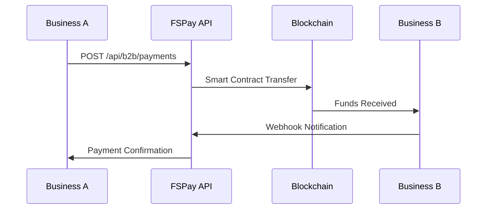
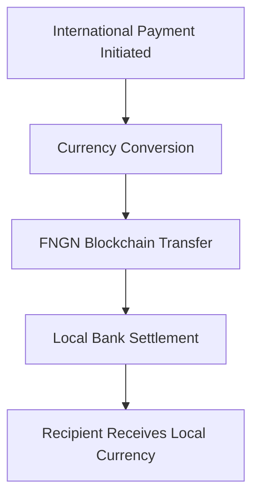

# FSPay B2B Settlement & Cross-Border Payment API

This document explains how businesses can integrate FSPay's stablecoin technology for B2B settlements and cross-border payments. The API provides traditional business workflows with the benefits of blockchain settlement.

## 📋 **Overview**

The FSPay B2B API enables businesses to:
- **Send & Receive Payments** using stablecoin technology
- **Cross-Border Settlements** with instant processing
- **Automated Reconciliation** with webhook notifications
- **Multi-Currency Support** for international trade
- **Escrow Protection** for high-value transactions

## 🏢 **B2B Account Setup**

### **Registration Process**
```http
POST /api/b2b/register
Content-Type: application/json

{
  "businessName": "Your Company Ltd",
  "businessEmail": "finance@yourcompany.com",
  "businessType": "e-commerce",
  "kycLevel": 1,
  "dailyLimit": 1000000,
  "webhookUrl": "https://yourcompany.com/webhooks/fspay"
}
```

**Business Types Supported:**
- `e-commerce` - Online retail and marketplaces
- `fintech` - Financial technology companies
- `marketplace` - Multi-vendor platforms
- `saas` - Software as a service providers
- `logistics` - Shipping and delivery services
- `other` - Other business categories

**Response:**
```json
{
  "success": true,
  "data": {
    "businessId": "biz_abc123def456",
    "apiKey": "your_api_key_here",
    "custodialWallet": "0x742d35Cc6635C0532925a3b8D0007d2e5e0f5e6f7",
    "status": "pending_approval",
    "dailyLimit": 1000000,
    "monthlyLimit": 10000000
  },
  "message": "Business registration submitted for review"
}
```

### **Application Steps**
After registration, complete the 5-step application process:
1. **Business Information** - Company details and operations
2. **Legal & Compliance** - Registration and compliance documents
3. **Financial Information** - Banking and volume projections
4. **Technical Setup** - API integration and webhook configuration
5. **Document Upload** - Supporting documentation and agreements

## 💰 **Payment Processing**

### **Send Payment to Another Business**
```http
POST /api/b2b/payments
Authorization: Bearer your_business_token
Content-Type: application/json
X-API-Key: your_api_key

{
  "toBusinessId": "biz_recipient_123",
  "amount": 50000,
  "currency": "FNGN",
  "reference": "INV_2025_001234",
  "description": "Payment for services rendered",
  "metadata": {
    "invoiceId": "INV_001234",
    "orderId": "ORD_567890",
    "project": "Website Development"
  }
}
```

**Response:**
```json
{
  "success": true,
  "data": {
    "transactionId": "txn_fngn_123456789",
    "status": "completed",
    "amount": 50000,
    "fee": 500,
    "netAmount": 49500,
    "reference": "INV_2025_001234",
    "blockchainTxHash": "0x8f3a2b1c9d4e5f6789abcdef0123456789abcdef0123456789abcdef0123456789",
    "estimatedSettlement": "2025-01-27T15:35:00Z"
  }
}
```

### **Payment Flow**


## 🌐 **Cross-Border Settlement**

### **International Payment Process**
1. **Currency Conversion**: Automatic conversion to recipient's currency
2. **Blockchain Transfer**: Instant transfer via stablecoin
3. **Local Settlement**: Bank transfer in recipient's currency
4. **Confirmation**: Real-time status updates via webhooks

### **Supported Currencies**
- **FNGN**: Nigerian Naira stablecoin (1:1 peg)
- **NGN**: Nigerian Naira (direct bank transfer)
- **USD**: US Dollar (international settlement)
- **EUR**: Euro (European settlement)
- **GBP**: British Pound (UK settlement)

### **Cross-Border Example**
```javascript
// Send $1,000 from Nigeria to UK business
const payment = await fspayClient.payments.create({
  toBusinessId: 'biz_uk_company',
  amount: 1000,
  currency: 'USD',
  reference: 'INT_PAY_001',
  description: 'International service payment',
  settlementCurrency: 'GBP', // Recipient receives in GBP
  metadata: {
    purpose: 'software_licensing',
    contractId: 'CON_2025_001'
  }
});
```

## 🏦 **Account Management**

### **Get Account Balance**
```http
GET /api/b2b/balance
X-API-Key: your_api_key
```

**Response:**
```json
{
  "success": true,
  "data": {
    "availableBalance": 250000.50,
    "escrowBalance": 50000.00,
    "dailyLimit": 1000000.00,
    "dailyUsed": 750000.00,
    "remainingDaily": 250000.00,
    "monthlyLimit": 10000000.00,
    "monthlyUsed": 2500000.00
  }
}
```

### **Deposit Funds**
```http
POST /api/b2b/deposit
X-API-Key: your_api_key
Content-Type: application/json

{
  "amount": 100000,
  "currency": "NGN"
}
```

### **Withdraw Funds**
```http
POST /api/b2b/withdraw
X-API-Key: your_api_key
Content-Type: application/json

{
  "amount": 50000,
  "recipient": "0x742d35Cc6635C0532925a3b8D0007d2e5e0f5e6f7"
}
```

## 📊 **Transaction Management**

### **Get Transaction History**
```http
GET /api/b2b/transactions?limit=50&offset=0&status=completed
X-API-Key: your_api_key
```

**Query Parameters:**
- `limit`: Number of transactions (max 100)
- `offset`: Pagination offset
- `status`: Filter by status (pending, completed, failed, refunded)
- `date_from`: Start date (YYYY-MM-DD)
- `date_to`: End date (YYYY-MM-DD)

### **Get Transaction Details**
```http
GET /api/b2b/transactions/{transactionId}
X-API-Key: your_api_key
```

**Response:**
```json
{
  "success": true,
  "data": {
    "transactionId": "txn_fngn_123456789",
    "type": "payment",
    "status": "completed",
    "amount": 50000,
    "fee": 500,
    "netAmount": 49500,
    "currency": "FNGN",
    "fromBusinessId": "biz_sender_123",
    "toBusinessId": "biz_recipient_456",
    "reference": "INV_2025_001234",
    "description": "Payment for services",
    "blockchainTxHash": "0x8f3a2b1c9d4e5f6789abcdef0123456789abcdef0123456789abcdef0123456789",
    "createdAt": "2025-01-27T14:30:00Z",
    "completedAt": "2025-01-27T14:30:15Z",
    "metadata": {
      "invoiceId": "INV_001234",
      "orderId": "ORD_567890"
    }
  }
}
```

## 🎣 **Webhook Integration**

### **Webhook Events**
Your webhook endpoint will receive these events:

- `payment.completed` - Payment successfully processed
- `payment.failed` - Payment failed
- `payment.refunded` - Payment was refunded
- `deposit.completed` - Funds deposited to account
- `withdrawal.completed` - Funds withdrawn from account
- `settlement.processed` - Cross-border settlement completed

### **Webhook Payload Example**
```json
{
  "event": "payment.completed",
  "timestamp": "2025-01-27T14:30:15Z",
  "data": {
    "transactionId": "txn_fngn_123456789",
    "fromBusinessId": "biz_sender_123",
    "toBusinessId": "biz_recipient_456",
    "amount": 50000,
    "fee": 500,
    "netAmount": 49500,
    "currency": "FNGN",
    "reference": "INV_2025_001234",
    "status": "completed",
    "blockchainTxHash": "0x1a2b3c4d5e6f7890abcdef1234567890abcdef1234567890abcdef1234567890"
  }
}
```

### **Webhook Security**
Verify webhook signatures using HMAC SHA256:
```javascript
const crypto = require('crypto');

function verifyWebhookSignature(payload, signature, secret) {
  const expectedSignature = crypto
    .createHmac('sha256', secret)
    .update(JSON.stringify(payload))
    .digest('hex');

  return crypto.timingSafeEqual(
    Buffer.from(signature, 'hex'),
    Buffer.from(expectedSignature, 'hex')
  );
}
```

## 🌍 **Cross-Border Settlement**

### **Settlement Process**


### **Settlement Example**
```javascript
// Send $5,000 from Nigeria to UK business
const settlement = await fspayClient.payments.create({
  toBusinessId: 'biz_uk_software',
  amount: 5000,
  currency: 'USD',
  settlementCurrency: 'GBP',
  reference: 'LIC_2025_001',
  description: 'Annual software license',
  metadata: {
    licenseType: 'enterprise',
    duration: '12_months',
    supportLevel: 'premium'
  }
});
```

## 💼 **Business Use Cases**

### **E-commerce Marketplace**
```javascript
// Split payment between marketplace and vendor
const marketplaceFee = orderTotal * 0.05; // 5% marketplace fee
const vendorAmount = orderTotal - marketplaceFee;

// Pay vendor directly
await fspayClient.payments.create({
  toBusinessId: vendorId,
  amount: vendorAmount,
  reference: `VENDOR_${orderId}`,
  description: `Order ${orderId} - Vendor payment`
});

// Marketplace keeps fee in account
```

### **International Service Payments**
```javascript
// Pay international freelancer
await fspayClient.payments.create({
  toBusinessId: 'freelancer_uk',
  amount: 2000,
  currency: 'USD',
  settlementCurrency: 'GBP',
  reference: `SERVICE_${projectId}`,
  description: 'Website development services'
});
```

### **Supply Chain Payments**
```javascript
// Pay international supplier
await fspayClient.payments.create({
  toBusinessId: 'supplier_china',
  amount: 15000,
  currency: 'USD',
  settlementCurrency: 'CNY',
  reference: `PO_${purchaseOrderId}`,
  description: 'Electronics component order'
});
```

## 🔐 **Security & Compliance**

### **KYC Requirements**
- **Individual Users**: Basic KYC for small transactions
- **Businesses**: Enhanced KYC with business registration
- **High Volume**: Advanced verification for large transactions
- **International**: Compliance with recipient country regulations

### **Risk Management**
- **Transaction Limits**: Tiered limits based on KYC level
- **Velocity Checks**: Unusual activity monitoring
- **Geographic Controls**: Country-specific restrictions
- **Amount Thresholds**: Enhanced verification for large payments

## 📈 **Analytics & Reporting**

### **Transaction Analytics**
```http
GET /api/b2b/analytics?period=30d
X-API-Key: your_api_key
```

**Response:**
```json
{
  "success": true,
  "data": {
    "totalVolume": 2500000.00,
    "totalTransactions": 150,
    "averageTransactionSize": 16666.67,
    "topRecipients": [
      {
        "businessId": "biz_partner_123",
        "businessName": "Partner Company",
        "totalAmount": 500000.00,
        "transactionCount": 25
      }
    ],
    "currencyBreakdown": {
      "FNGN": 2000000.00,
      "USD": 500000.00
    },
    "dailyVolume": [/* 30 days of data */]
  }
}
```

## 🚦 **Rate Limits & Pricing**

### **Rate Limits**
| Endpoint | Limit | Window |
|----------|-------|--------|
| `/payments` | 100 requests | 1 hour |
| `/balance` | 1000 requests | 1 hour |
| `/transactions` | 500 requests | 1 hour |
| `/deposit` | 50 requests | 1 hour |
| `/withdraw` | 20 requests | 1 hour |

### **Fee Structure**
- **B2B Payments**: 0.5-1.0% (volume-based discount)
- **Cross-Border**: 1-2% (includes bank charges)
- **Settlement**: 0.1-0.5% (based on currency)
- **Monthly Fee**: ₦10,000-₦50,000 (based on volume)

## 🛠️ **SDK Integration**

### **JavaScript SDK**
```javascript
const { FSPayB2B } = require('@fspay/b2b-sdk');

const client = new FSPayB2B({
  apiKey: 'your_api_key',
  environment: 'production', // or 'sandbox'
  webhookSecret: 'your_webhook_secret'
});

// Send payment
const payment = await client.payments.create({
  toBusinessId: 'recipient_business',
  amount: 50000,
  reference: 'PAY_001234'
});

// Handle webhook
client.webhooks.on('payment.completed', (payload) => {
  console.log('Payment completed:', payload.transactionId);
});
```

### **Python SDK**
```python
from fspay_b2b import FSPayClient

client = FSPayClient(
    api_key='your_api_key',
    environment='production'
)

# Create payment
payment = client.payments.create(
    to_business_id='recipient_business',
    amount=50000,
    reference='PAY_001234'
)

# Get balance
balance = client.balance.get()
```

## 📋 **Integration Checklist**

### **Pre-Integration**
- [ ] **API Access**: Request and receive API credentials
- [ ] **Webhook Setup**: Configure webhook endpoint for notifications
- [ ] **KYC Completion**: Complete business verification process
- [ ] **Testing**: Test with sandbox environment first

### **Technical Setup**
- [ ] **Environment Variables**: Configure API keys and endpoints
- [ ] **Error Handling**: Implement comprehensive error handling
- [ ] **Webhook Verification**: Set up signature verification
- [ ] **Rate Limiting**: Implement retry logic and rate limit handling
- [ ] **Logging**: Set up transaction and error logging

### **Security Measures**
- [ ] **API Key Protection**: Never commit keys to version control
- [ ] **HTTPS Only**: Use HTTPS for all API communications
- [ ] **Input Validation**: Validate all input data thoroughly
- [ ] **Audit Logging**: Log all API requests and responses

## 🚀 **Quick Start Example**

### **Complete Integration Flow**
```javascript
const FSPayClient = require('@fspay/b2b-sdk');

async function setupBusinessIntegration() {
  // 1. Initialize client
  const client = new FSPayClient({
    apiKey: process.env.FSPAY_API_KEY,
    environment: 'sandbox'
  });

  // 2. Check account status
  const accountInfo = await client.account.getInfo();
  console.log('Account status:', accountInfo.status);

  // 3. Get current balance
  const balance = await client.balance.get();
  console.log('Available balance:', balance.availableBalance);

  // 4. Send a test payment
  const payment = await client.payments.create({
    toBusinessId: 'test_recipient',
    amount: 1000,
    currency: 'FNGN',
    reference: 'TEST_001',
    description: 'Integration test payment'
  });

  console.log('Payment result:', payment);

  // 5. Set up webhook handling
  client.webhooks.on('payment.completed', (payload) => {
    console.log('Payment completed:', payload.transactionId);
    // Process successful payment
  });

  return client;
}

// Usage
setupBusinessIntegration()
  .then(client => {
    console.log('FSPay integration ready!');
    // Start processing payments
  })
  .catch(error => {
    console.error('Integration failed:', error);
  });
```

## 📞 **Support & Resources**

### **Integration Support**
- **Email**: b2b-support@fspay.ng
- **Documentation**: Complete API reference and guides
- **Sandbox**: Free testing environment
- **Community**: Developer forums and Slack channel

### **Enterprise Services**
- **Dedicated Support**: Priority support for enterprise customers
- **Custom Integration**: Tailored solutions for specific requirements
- **SLA Guarantees**: 99.9% uptime and performance commitments
- **Direct Engineering**: Direct access to integration specialists

## 🔄 **Migration from Traditional Banking**

### **Cost Comparison**
| Service | Traditional Bank | FSPay B2B |
|---------|------------------|------------|
| Cross-border transfer | 3-5% + $25-50 | 1-2% |
| Processing time | 1-5 business days | 2-5 minutes |
| Settlement | Next day | Same day |
| Transparency | Limited | Real-time tracking |

### **Migration Steps**
1. **Parallel Testing**: Run both systems during transition
2. **Gradual Migration**: Start with low-value transactions
3. **Webhook Integration**: Set up real-time notifications
4. **Reconciliation**: Implement automated reconciliation
5. **Go Live**: Switch to full production usage

---

**FSPay B2B API** - Enterprise-grade payment processing with the efficiency of blockchain technology.

*This documentation provides integration guidance without revealing implementation details.*
