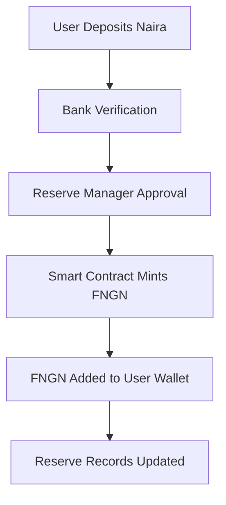
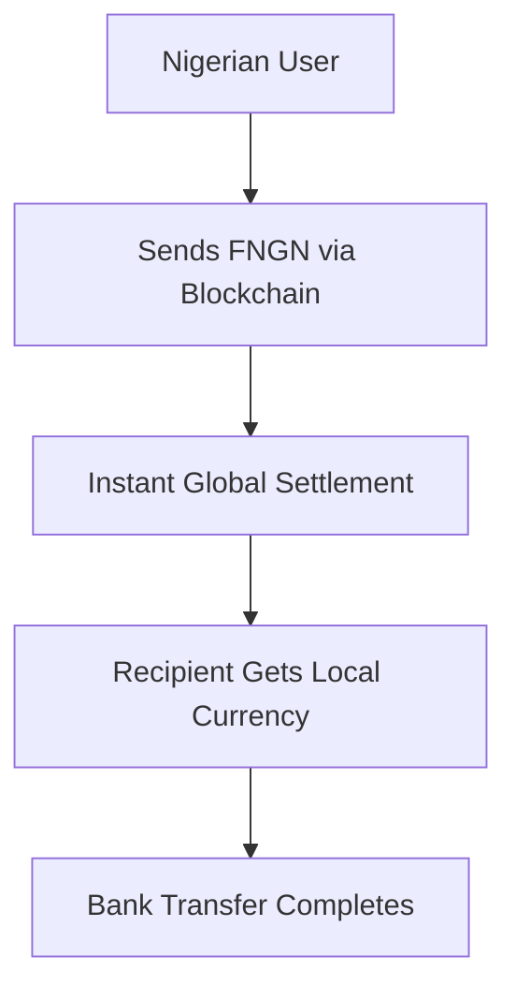
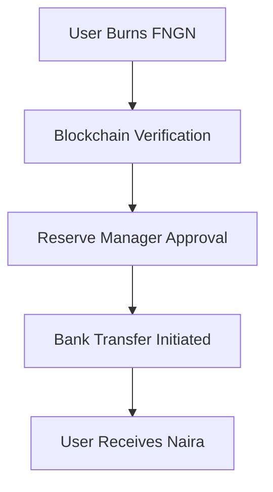
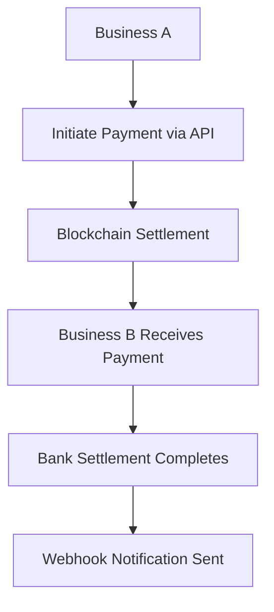
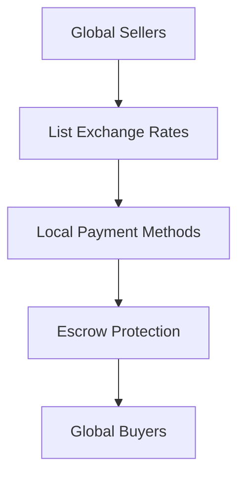

# FSPay Blockchain & Stablecoin System

This document explains how FSPay's blockchain infrastructure enables secure, transparent, and efficient cross-border payments and B2B settlements. The system combines traditional payment flows with blockchain technology for enhanced security and global reach.

## 🏦 **FNGN Stablecoin Architecture**

FNGN is a Nigerian Naira-pegged stablecoin designed for seamless cross-border value transfer while maintaining the stability of traditional banking.

### **Core Features**
- **1:1 Naira Peg**: 1 FNGN = 1 NGN, always
- **Multi-Chain Support**: Available on Ethereum, BSC, and other networks
- **Instant Settlement**: Near-instant cross-border transfers
- **Reserve Backing**: 100%+ reserve backing with real-time transparency
- **Regulatory Compliance**: Built for Nigerian and international regulations

### **How FNGN Works**

#### **Minting Process**


#### **Cross-Border Transfer**


#### **Redemption Process**


## 🌐 **Cross-Border Payment Flow**

FNGN enables businesses and individuals to send money internationally with the speed of blockchain and the reliability of traditional banking.

### **International Payment Process**
1. **Sender** deposits Naira via bank transfer or payment gateway
2. **FNGN minted** and credited to sender's wallet (1:1 ratio)
3. **Blockchain transfer** initiated to recipient's wallet
4. **Recipient redeems** FNGN for their local currency
5. **Bank settlement** completes the transaction

### **Settlement Options**
- **Same-Day Settlement**: Instant bank transfers for supported countries
- **Next-Day Settlement**: Standard processing for international banks
- **Real-Time Verification**: Live transaction tracking and confirmation
- **Multi-Currency Support**: Settlement in recipient's preferred currency

## 🏢 **B2B Payment Gateway**

The B2B payment gateway enables businesses to send and receive large payments using stablecoin technology while maintaining traditional business workflows.

### **Business Account Setup**
```http
POST /api/b2b/register
Content-Type: application/json

{
  "businessName": "Your Company Ltd",
  "businessEmail": "finance@yourcompany.com",
  "businessType": "e-commerce",
  "dailyLimit": 1000000,
  "webhookUrl": "https://yourcompany.com/webhooks/fspay"
}
```

**Business Types Supported:**
- **E-commerce**: Online retail and marketplaces
- **Fintech**: Financial technology companies
- **Marketplace**: Multi-vendor platforms
- **SaaS**: Software as a service providers
- **Logistics**: Shipping and delivery services

### **B2B Payment Flow**


### **Payment Processing**
- **Large Volume Support**: Handle payments up to ₦10M+ per transaction
- **Instant Confirmation**: Real-time payment verification
- **Batch Processing**: Process multiple payments efficiently
- **Automated Reconciliation**: API-based transaction matching

## 🔄 **P2P Trading Platform**

The P2P trading platform enables global currency exchange with local payment methods and blockchain security.

### **Trading Architecture**


### **Trading Features**
- **Multi-Currency Trading**: Exchange between NGN, USD, EUR, GBP and stablecoins
- **Local Payment Methods**: Bank transfers, mobile money, cash payments
- **Escrow Protection**: Smart contract security for all transactions
- **Cross-Border Trading**: International participants with local settlement
- **Rating System**: Trust and reputation management

### **Advertisement System**
Sellers can list competitive exchange rates for international buyers:

```javascript
// Create advertisement for international trading
const advertisement = await p2pClient.advertisements.create({
  adType: 'SELL_FNGN',
  sourceCurrency: 'USD', // Accept USD payments
  targetStablecoin: 'FNGN',
  rate: 750.50, // Competitive rate for international buyers
  paymentMethods: ['Wire Transfer', 'International ACH'],
  supportedCountries: ['US', 'CA', 'GB', 'DE', 'AU'],
  instructions: 'Wire transfer to provided international account'
});
```

## 🛡️ **Security & Risk Management**

### **Multi-Layer Security**
1. **Blockchain Security**: Cryptographic transaction verification
2. **Smart Contract Audits**: Independent security reviews
3. **KYC/AML Compliance**: Regulatory compliance for all users
4. **Reserve Transparency**: Real-time proof-of-reserve verification
5. **Insurance Coverage**: Protection against smart contract risks

### **Risk-Based Settlement**
- **Auto-Settle (5 minutes)**: Trusted sellers with excellent ratings
- **Quick-Settle (6 hours)**: Established sellers with good performance
- **Standard Escrow (24-72 hours)**: New sellers or large amounts
- **Extended Escrow (7 days)**: High-risk situations or disputes

### **Dispute Resolution**
- **Automated Resolution**: Smart contract-based dispute handling
- **Mediation System**: Built-in mediation for complex disputes
- **Refund Protection**: Automatic refunds for legitimate claims
- **Evidence Collection**: Digital evidence submission system

## 🌍 **Cross-Border Use Cases**

### **International Remittances**
- **Workers Abroad**: Send money home instantly to Nigerian families
- **Family Support**: Regular remittance payments with low fees
- **Emergency Transfers**: Critical funds transfer with speed priority
- **Investment Flows**: Cross-border investment and capital flows

### **B2B International Trade**
- **Import/Export**: Pay international suppliers with instant settlement
- **Service Payments**: Freelancer and contractor payments across borders
- **Marketplace Settlements**: Multi-currency marketplace payment processing
- **Supply Chain**: Global supply chain payment optimization

### **E-commerce Expansion**
- **Cross-Border Sales**: Accept international payments with local settlement
- **Global Marketplaces**: Multi-currency marketplace platforms
- **Digital Services**: International service payment processing
- **Subscription Billing**: Global subscription and recurring payments

## 📊 **Performance Metrics**

### **Transaction Speed**
- **FNGN Transfers**: < 30 seconds blockchain confirmation
- **Cross-Border**: 2-5 minutes total processing time
- **Bank Settlement**: Same business day completion
- **P2P Trading**: 5-15 minutes with escrow protection

### **Cost Structure**
- **Minting Fee**: 0.5-1.0% (volume-based discount)
- **Transfer Fee**: < 0.1% for blockchain transfers
- **Redemption Fee**: 0.5-1.0% for bank withdrawals
- **Cross-Border Fee**: 1-2% (includes bank charges)

### **Volume Discounts**
```javascript
// Business volume discount tiers
const feeTiers = {
  starter: { minVolume: 0, fee: 1.0 },          // $0+ monthly
  bronze:  { minVolume: 100000, fee: 0.8 },    // $100K+ monthly
  silver:  { minVolume: 1000000, fee: 0.6 },   // $1M+ monthly
  gold:    { minVolume: 10000000, fee: 0.4 }   // $10M+ monthly
};
```

## 🔧 **Integration Options**

### **Direct API Integration**
```javascript
// Direct REST API integration
const response = await fetch('https://api.fspay.ng/api/b2b/payments', {
  method: 'POST',
  headers: {
    'Content-Type': 'application/json',
    'X-API-Key': 'your_business_api_key'
  },
  body: JSON.stringify({
    toBusinessId: 'recipient_business',
    amount: 50000,
    currency: 'FNGN',
    reference: 'INV_2025_001234'
  })
});
```

### **SDK Integration**
```javascript
// SDK-based integration
const client = new FSPayB2B({
  apiKey: 'your_api_key',
  environment: 'production'
});

const payment = await client.payments.create({
  toBusinessId: 'recipient_business',
  amount: 50000,
  reference: 'INV_2025_001234'
});
```

### **Webhook Integration**
```javascript
// Real-time notification handling
client.webhooks.on('payment.completed', (payload) => {
  console.log('Payment completed:', payload.transactionId);
  // Update your systems
  // Send notifications
  // Trigger workflows
});
```

## 🌟 **Advanced Features**

### **Multi-Currency Settlement**
- **Automatic Conversion**: Convert FNGN to recipient's preferred currency
- **Best Rate Selection**: Automatic selection of optimal exchange rates
- **Settlement Optimization**: Choose fastest/cheapest settlement method
- **Real-Time Tracking**: Live settlement progress monitoring

### **Batch Processing**
- **Bulk Payments**: Process hundreds of payments in single transaction
- **Settlement Batching**: Optimize blockchain gas costs
- **Automated Reconciliation**: Batch-level transaction matching
- **Performance Analytics**: Batch processing metrics and reporting

### **Risk Management**
- **Dynamic Limits**: Adjust limits based on user behavior and market conditions
- **Geographic Controls**: Country-specific trading and payment restrictions
- **Amount Thresholds**: Enhanced verification for large transactions
- **Behavioral Analysis**: Pattern recognition for fraud prevention

## 📈 **Analytics & Monitoring**

### **Real-Time Metrics**
- **Transaction Volume**: Live payment volume tracking
- **Settlement Success**: Real-time settlement completion rates
- **Geographic Distribution**: Payment origin and destination analysis
- **Currency Performance**: Exchange rate and conversion analytics

### **Business Intelligence**
- **Payment Patterns**: Identify trends and optimize operations
- **Cost Analysis**: Fee optimization and cost reduction insights
- **Performance Benchmarking**: Compare against industry standards
- **Risk Assessment**: Continuous risk evaluation and adjustment

## 🚀 **Getting Started**

### **For Individual Users**
1. **Create Account**: Sign up with email and phone verification
2. **Complete KYC**: Identity verification for compliance
3. **Add Payment Method**: Link bank account or mobile money
4. **Start Transacting**: Send and receive FNGN instantly

### **For Businesses**
1. **Apply Online**: Submit business registration form
2. **API Integration**: Get API credentials after approval
3. **Testing**: Use sandbox environment for development
4. **Go Live**: Switch to production after testing

### **For Developers**
1. **API Access**: Request developer credentials
2. **Documentation**: Review integration guides and examples
3. **Testing**: Use sandbox for development and testing
4. **Support**: Access to developer support team

## 📞 **Support & Resources**

### **Technical Support**
- **API Documentation**: Complete endpoint reference and examples
- **Integration Guides**: Step-by-step integration tutorials
- **Code Examples**: Multiple programming languages and frameworks
- **Testing Tools**: Sandbox environment and validation utilities

### **Business Support**
- **Enterprise Integration**: Dedicated support for large businesses
- **Custom Solutions**: Tailored integration for specific requirements
- **SLA Guarantees**: 99.9% uptime and performance commitments
- **Direct Engineering**: Access to blockchain and integration specialists

## 🔄 **Migration from Traditional Systems**

### **Cost Comparison**
| Service | Traditional Bank | FSPay B2B |
|---------|------------------|------------|
| Cross-border transfer | 3-5% + $25-50 | 1-2% |
| Processing time | 1-5 business days | 2-5 minutes |
| Settlement | Next day | Same day |
| Transparency | Limited | Real-time tracking |

### **Migration Benefits**
- **Reduced Costs**: 60-80% cost reduction for international payments
- **Faster Processing**: Days to minutes processing time
- **Enhanced Security**: Blockchain-level security with bank settlement
- **Global Reach**: Access to international markets and partners
- **Operational Efficiency**: Automated reconciliation and reporting

## 📋 **Compliance & Regulation**

### **Regulatory Compliance**
- **CBN Alignment**: Compliant with Nigerian banking regulations
- **International Standards**: Follows FATF and international AML guidelines
- **KYC Requirements**: Multi-tier verification system
- **Reporting**: Automated regulatory reporting

### **Transparency Features**
- **Real-Time Reserves**: Live reserve balance verification
- **Audit Trails**: Complete transaction history
- **Public Dashboards**: Reserve and network status visibility
- **Independent Audits**: Regular third-party verification

---

**FSPay Blockchain Infrastructure** - Enterprise-grade stablecoin and payment processing with the efficiency of blockchain technology and the reliability of traditional banking.

*This documentation provides blockchain integration guidance without revealing implementation details or exposing sensitive code.*
