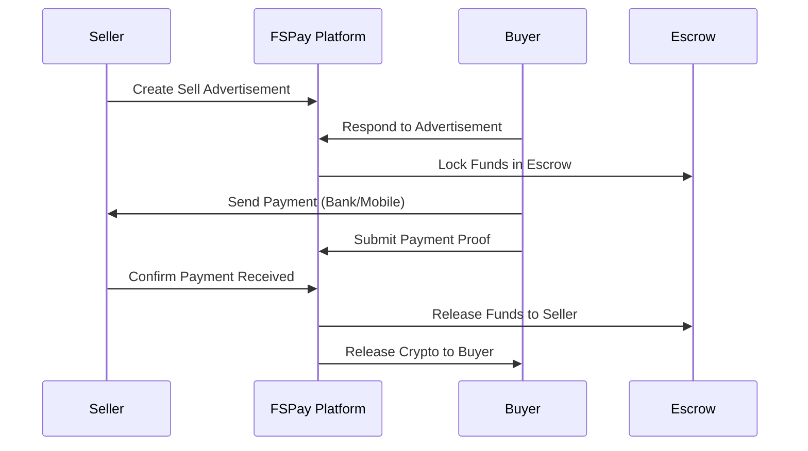
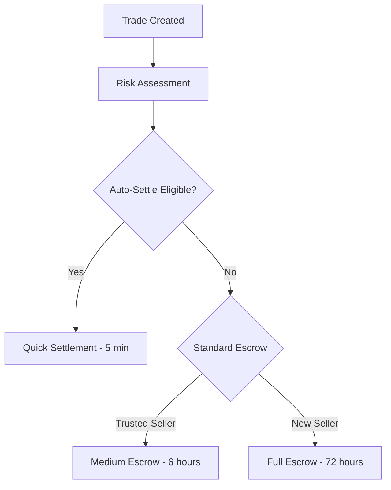
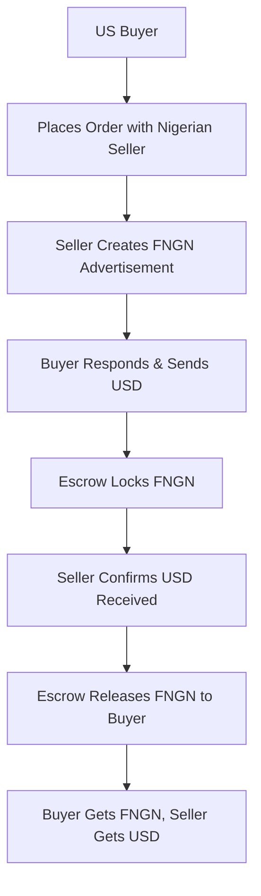

# FSPay P2P Trading & Cross-Border Exchange API

This document explains FSPay's Peer-to-Peer trading platform and how it enables cross-border currency exchange with escrow protection. The P2P system connects buyers and sellers globally while providing security and compliance.

## 📋 **Overview**

The FSPay P2P Trading API enables:
- **Global Currency Exchange** between fiat currencies and stablecoins
- **Escrow Protection** for secure transactions
- **Multi-Payment Methods** including bank transfers and mobile money
- **Cross-Border Trading** with international participants
- **Rating System** for trust and reputation management

## 🔄 **P2P Trading Flow**

### **Complete Trading Process**


### **Advertisement Creation**
```http
POST /api/p2p/advertisements
Authorization: Bearer user_token
Content-Type: application/json
X-API-Key: api_key

{
  "adType": "SELL_FNGN",
  "sourceCurrency": "NGN",
  "targetStablecoin": "FNGN",
  "rate": 750.50,
  "minAmount": 10000,
  "maxAmount": 100000,
  "totalAmount": 50000,
  "paymentMethods": ["Bank Transfer", "Mobile Money"],
  "instructions": "Transfer to Account: 1234567890 (Access Bank)",
  "expiresAt": "2025-01-28T00:00:00Z"
}
```

**Advertisement Types:**
- `SELL_FNGN` - Sell FNGN for local currency
- `BUY_FNGN` - Buy FNGN with local currency
- `SELL_STABLECOIN` - Sell other stablecoins
- `BUY_STABLECOIN` - Buy other stablecoins

**Response:**
```json
{
  "success": true,
  "data": {
    "adId": "ad_1234567890abcdef",
    "status": "active",
    "expiresAt": "2025-01-28T00:00:00Z",
    "availableAmount": 50000,
    "rate": 750.50,
    "paymentMethods": ["Bank Transfer", "Mobile Money"]
  }
}
```

## 🌍 **Cross-Border Trading**

### **International Seller Setup**
Sellers can list competitive exchange rates for international buyers:

```javascript
// Create advertisement for international buyers
const advertisement = await p2pClient.advertisements.create({
  adType: 'SELL_FNGN',
  sourceCurrency: 'USD', // Accept USD payments
  targetStablecoin: 'FNGN',
  rate: 750.50, // 1 USD = 750.50 FNGN
  minAmount: 100, // $100 minimum
  maxAmount: 10000, // $10,000 maximum
  paymentMethods: ['Wire Transfer', 'International Bank Transfer'],
  instructions: 'Wire to: Bank of America, Account: 123456789, SWIFT: BOFAUS3N',
  supportedCountries: ['US', 'CA', 'GB', 'DE'], // Accept from these countries
  region: 'North America'
});
```

### **Global Payment Methods**
- **Wire Transfers**: International bank transfers
- **International ACH**: US/Canada/Europe bank transfers
- **SWIFT Payments**: Global banking network
- **Mobile Money**: International mobile money transfers
- **Digital Wallets**: PayPal, Venmo, international wallets

## 🛡️ **Escrow Protection System**

### **Multi-Tier Escrow**


### **Risk-Based Settlement**
- **Auto-Settle (5 minutes)**: Trusted sellers with excellent ratings
- **Quick-Settle (6 hours)**: Established sellers with good performance
- **Standard Escrow (24-72 hours)**: New sellers or large amounts
- **Extended Escrow (7 days)**: High-risk situations or disputes

## 💱 **Cross-Border Exchange Examples**

### **Nigeria to International**
```javascript
// Nigerian seller accepts international payments
const sellAd = await p2pClient.advertisements.create({
  adType: 'SELL_FNGN',
  sourceCurrency: 'USD',
  targetStablecoin: 'FNGN',
  rate: 750.50, // Competitive rate for international buyers
  paymentMethods: ['Wire Transfer', 'International ACH'],
  instructions: `
    1. Send USD via wire transfer to provided account
    2. Include reference: FSPAY_[AD_ID]
    3. Send payment proof via chat
    4. FNGN will be released after confirmation
  `,
  supportedCountries: ['US', 'CA', 'GB', 'DE', 'AU'],
  autoSettleLimit: 1000 // Auto-release up to $1,000
});
```

### **International to Nigeria**
```javascript
// International buyer purchases FNGN
const buyAd = await p2pClient.advertisements.create({
  adType: 'BUY_FNGN',
  sourceCurrency: 'USD',
  targetStablecoin: 'FNGN',
  rate: 748.00, // Buy rate from international sellers
  paymentMethods: ['Wire Transfer', 'Bank Transfer'],
  instructions: 'International wire transfer to Nigerian bank account',
  region: 'Nigeria',
  maxAmount: 5000 // Maximum single transaction
});
```

## 📱 **Trade Management API**

### **Respond to Advertisement**
```http
POST /api/p2p/trade-responses
Authorization: Bearer user_token
Content-Type: application/json
X-API-Key: api_key

{
  "adId": "ad_1234567890abcdef",
  "amount": 25000,
  "paymentMethod": "Bank Transfer",
  "message": "Ready to proceed with payment"
}
```

**Response:**
```json
{
  "success": true,
  "data": {
    "tradeId": "trade_abcdef1234567890",
    "status": "waiting_for_payment",
    "amount": 25000,
    "rate": 750.50,
    "totalValue": 18762.50,
    "paymentInstructions": "Transfer ₦18,762.50 to Account: 1234567890",
    "expiresAt": "2025-01-27T15:30:00Z",
    "escrowAmount": 25000
  }
}
```

### **Submit Payment Proof**
```http
POST /api/p2p/payment-proof
Authorization: Bearer user_token
Content-Type: application/json
X-API-Key: api_key

{
  "tradeId": "trade_abcdef1234567890",
  "paymentProof": "https://your-cdn.com/payment-receipts/receipt_12345.jpg",
  "paymentReference": "TRF_123456789",
  "notes": "Payment sent via mobile banking"
}
```

### **Trade Chat System**
```http
POST /api/p2p/trade-messages
Authorization: Bearer user_token
Content-Type: application/json
X-API-Key: api_key

{
  "tradeId": "trade_abcdef1234567890",
  "message": "Payment has been sent. Reference: TRF_123456789",
  "messageType": "text",
  "attachments": []
}
```

## 🌐 **Global Trading Features**

### **Multi-Currency Support**
```javascript
// Trade between different currencies
const multiCurrencyTrade = await p2pClient.advertisements.create({
  adType: 'SELL_FNGN',
  sourceCurrency: 'EUR',
  targetStablecoin: 'FNGN',
  rate: 850.00, // 1 EUR = 850 FNGN
  paymentMethods: ['SEPA Transfer', 'International Wire'],
  supportedCountries: ['DE', 'FR', 'IT', 'ES', 'NL'],
  instructions: 'SEPA transfer to German bank account',
  region: 'European Union'
});
```

### **Regional Trading Hubs**
- **Africa**: NGN, KES, ZAR, GHS, EGP trades
- **Europe**: EUR, GBP, CHF stablecoin exchanges
- **North America**: USD, CAD, MXN trading
- **Asia-Pacific**: SGD, AUD, HKD, JPY exchanges

## 🏦 **Payment Method Integration**

### **Bank Transfer Trading**
```javascript
const bankTrade = await p2pClient.advertisements.create({
  adType: 'BUY_FNGN',
  sourceCurrency: 'NGN',
  targetStablecoin: 'FNGN',
  rate: 1.00, // 1:1 rate for bank transfers
  paymentMethods: ['Bank Transfer'],
  bankDetails: {
    bankName: 'Access Bank',
    accountNumber: '1234567890',
    accountName: 'John Doe Trading',
    routingNumber: '044' // Nigerian bank code
  },
  instructions: `
    1. Transfer exact amount to provided account
    2. Include trade ID in payment reference
    3. Send payment proof immediately
    4. FNGN released after bank confirmation
  `
});
```

### **Mobile Money Trading**
```javascript
const mobileMoneyTrade = await p2pClient.advertisements.create({
  adType: 'SELL_FNGN',
  sourceCurrency: 'USD',
  targetStablecoin: 'FNGN',
  rate: 750.00,
  paymentMethods: ['Mobile Money', 'Bank Transfer'],
  mobileMoneyProviders: ['M-Pesa', 'Airtel Money', 'MTN MoMo'],
  instructions: 'Send via M-Pesa to +254700123456',
  supportedCountries: ['KE', 'TZ', 'UG', 'GH']
});
```

## 📊 **Trading Analytics**

### **Get Trading Statistics**
```http
GET /api/p2p/user-stats
Authorization: Bearer user_token
```

**Response:**
```json
{
  "success": true,
  "data": {
    "totalAdsCreated": 25,
    "activeAdsCount": 3,
    "completedTrades": 150,
    "totalVolumeUsd": 50000.00,
    "successRate": 98.5,
    "averageResponseTime": 15, // minutes
    "averageRating": 4.8,
    "trustScore": 95,
    "verificationLevel": "premium"
  }
}
```

### **Market Data**
```http
GET /api/p2p/market-data?currency=NGN&stablecoin=FNGN
```

**Response:**
```json
{
  "success": true,
  "data": {
    "bestBuyRate": 748.50,
    "bestSellRate": 750.50,
    "averageRate": 749.25,
    "dailyVolume": 2500000.00,
    "activeAds": 45,
    "topPaymentMethods": ["Bank Transfer", "Mobile Money"],
    "priceTrend": "stable" // stable, rising, falling
  }
}
```

## 🛡️ **Security & Compliance**

### **KYC Requirements for Trading**
- **Basic Trading**: Email and phone verification
- **Higher Limits**: Government ID verification
- **International Trading**: Enhanced KYC with address proof
- **High Volume**: Business verification and compliance checks

### **Risk Management**
- **Transaction Limits**: Tiered limits based on verification level
- **Geographic Controls**: Country-specific trading restrictions
- **Amount Thresholds**: Enhanced verification for large trades
- **Dispute Protection**: Built-in mediation and resolution

## 💰 **Fee Structure**

### **Trading Fees**
- **Platform Fee**: 0.5-1.0% of trade value
- **Payment Method Fees**: Vary by payment method
- **Cross-Border Fees**: 1-2% additional for international trades
- **Escrow Fees**: None (included in platform fee)

### **Volume Discounts**
```javascript
// Monthly volume discount tiers
const feeTiers = {
  tier1: { minVolume: 100000, fee: 1.0 },    // $100K+ monthly
  tier2: { minVolume: 1000000, fee: 0.7 },  // $1M+ monthly
  tier3: { minVolume: 10000000, fee: 0.5 }  // $10M+ monthly
};
```

## 🌟 **Advanced Trading Features**

### **Bulk Trading**
```javascript
// Create multiple advertisements
const bulkAds = await p2pClient.advertisements.createBulk([
  {
    adType: 'SELL_FNGN',
    sourceCurrency: 'USD',
    targetStablecoin: 'FNGN',
    rate: 750.00,
    amount: 10000,
    paymentMethods: ['Wire Transfer']
  },
  {
    adType: 'BUY_FNGN',
    sourceCurrency: 'EUR',
    targetStablecoin: 'FNGN',
    rate: 850.00,
    amount: 5000,
    paymentMethods: ['SEPA']
  }
]);
```

### **Auto-Trading**
```javascript
// Set up automatic trading rules
const autoTrade = await p2pClient.automation.create({
  strategy: 'rate_matching',
  targetRate: 750.00,
  maxAmount: 10000,
  paymentMethods: ['Bank Transfer'],
  autoAccept: true,
  notificationSettings: {
    newTrades: true,
    priceAlerts: true,
    marketUpdates: false
  }
});
```

## 📱 **Mobile Integration**

### **Mobile-Optimized Trading**
```javascript
// Mobile-friendly trading API
const mobileTrade = await p2pClient.trades.create({
  adId: 'ad_mobile_friendly',
  amount: 5000,
  paymentMethod: 'Mobile Money',
  deviceInfo: {
    platform: 'ios',
    appVersion: '1.2.0',
    location: 'Lagos, Nigeria'
  }
});
```

## 🔄 **Cross-Border Settlement Flow**

### **International Trade Settlement**


### **Settlement Example**
```javascript
// Cross-border settlement process
const internationalTrade = await p2pClient.trades.create({
  adId: 'ad_us_seller_ngn',
  amount: 1000, // $1,000 USD
  paymentMethod: 'Wire Transfer',
  settlementInstructions: {
    intermediaryBank: 'Chase Bank',
    correspondentBank: 'Access Bank Nigeria',
    beneficiaryAccount: '1234567890',
    swiftCode: 'FCBKNGLAXXX'
  }
});

// Track settlement progress
p2pClient.trades.on('status.update', (trade) => {
  switch(trade.status) {
    case 'payment_sent':
      console.log('Wire transfer initiated');
      break;
    case 'payment_confirmed':
      console.log('Payment confirmed by seller');
      break;
    case 'escrow_released':
      console.log('FNGN released to buyer');
      break;
  }
});
```

## 📞 **Support & Resources**

### **Trading Support**
- **24/7 Trading Support**: Available for active trades
- **Dispute Resolution**: Dedicated mediation team
- **Educational Resources**: Trading guides and tutorials
- **Community Forums**: Trader discussions and tips

### **Compliance Support**
- **KYC Assistance**: Help with verification process
- **Regulatory Guidance**: Compliance requirements by country
- **Risk Assessment**: Trading limit increases
- **Legal Support**: Regulatory compliance guidance

## 🚀 **Getting Started with P2P Trading**

### **Step 1: Account Setup**
1. **Create Account**: Sign up with email verification
2. **Complete KYC**: Identity verification for trading
3. **Add Payment Methods**: Link bank accounts and mobile money
4. **Set Trading Preferences**: Choose currencies and regions

### **Step 2: First Trade**
1. **Browse Market**: View current exchange rates
2. **Choose Advertisement**: Select suitable trading partner
3. **Respond to Trade**: Submit trade request
4. **Complete Payment**: Send payment via chosen method
5. **Confirm Receipt**: Verify payment and release escrow

### **Step 3: Advanced Trading**
1. **Create Advertisements**: Set your own exchange rates
2. **Build Reputation**: Earn ratings and trust scores
3. **Expand Operations**: Increase limits and add payment methods
4. **Automate Trading**: Set up automated trading rules

## 📋 **Trading Best Practices**

### **For Sellers**
- ✅ **Competitive Rates**: Offer better rates than banks/exchanges
- ✅ **Fast Response**: Respond to trade requests quickly
- ✅ **Clear Instructions**: Provide detailed payment instructions
- ✅ **Proof of Funds**: Show ability to fulfill large trades
- ✅ **Professional Service**: Build trust through consistent performance

### **For Buyers**
- ✅ **Verify Sellers**: Check ratings and trade history
- ✅ **Follow Instructions**: Carefully follow payment instructions
- ✅ **Prompt Payment**: Send payments quickly to avoid cancellation
- ✅ **Keep Records**: Save all payment receipts and references
- ✅ **Report Issues**: Use dispute system for problems

---

**FSPay P2P Trading** - Global currency exchange with local payment methods and blockchain security.

*This documentation provides trading guidance without revealing implementation details.*
