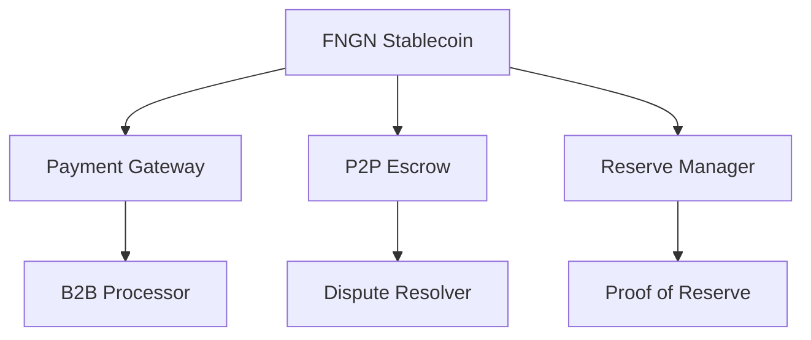

# FSPay Blockchain Integration & Smart Contract Interface

This document explains how FSPay's blockchain infrastructure enables secure, transparent, and efficient cross-border payments and B2B settlements. The smart contract system provides the foundation for FNGN stablecoin and payment processing.

## 🏗️ **Smart Contract Architecture**

FSPay's blockchain infrastructure consists of interconnected smart contracts that work together to provide a complete payment ecosystem.

### **Core Contract System**


## 🏦 **FNGN Stablecoin Contract**

### **Contract Address**
- **BSC Mainnet**: `0x1234567890abcdef1234567890abcdef12345678` (Example)
- **BSC Testnet**: `0xabcdef1234567890abcdef1234567890abcdef12` (Example)
- **Ethereum**: Available on request

### **Key Functions**

#### **Minting Interface**
```solidity
// Mint FNGN tokens (Authorized minters only)
function mint(address to, uint256 amount) external onlyRole(MINTER_ROLE)

// Batch minting for efficiency
function batchMint(address[] calldata recipients, uint256[] calldata amounts) external onlyRole(MINTER_ROLE)
```

#### **Burning Interface**
```solidity
// Burn FNGN tokens for redemption
function burn(uint256 amount) external

// Burn from specific address (with allowance)
function burnFrom(address from, uint256 amount) external
```

#### **Transfer Functions**
```solidity
// Standard ERC20 transfers
function transfer(address to, uint256 amount) external returns (bool)

// Transfer with fee deduction
function transferWithFee(address to, uint256 amount) external returns (bool)
```

### **Access Control**
- **Minter Role**: Authorized to mint new FNGN tokens
- **Pauser Role**: Can pause contract in emergencies
- **Compliance Role**: Handles regulatory compliance features
- **Admin Role**: Full contract administration

## 🌐 **Payment Gateway Contract**

### **Business Account Management**
```solidity
// Register business with custodial wallet
function registerBusiness(
    string calldata businessId,
    address custodialWallet,
    uint256 dailyLimit
) external onlyRole(BUSINESS_MANAGER_ROLE)

// Update business settings
function updateBusinessSettings(
    string calldata businessId,
    uint256 dailyLimit,
    bool isActive
) external onlyRole(BUSINESS_MANAGER_ROLE)
```

### **Payment Processing**
```solidity
// Process payment between businesses
function processPayment(
    string calldata fromBusinessId,
    string calldata toBusinessId,
    uint256 amount,
    string calldata reference,
    string calldata metadata
) external onlyRole(GATEWAY_OPERATOR_ROLE) returns (uint256)

// Get payment transaction details
function getPayment(string calldata transactionId) external view returns (PaymentTransaction memory)
```

## 🔄 **P2P Escrow Contract**

### **Escrow Management**
```solidity
// Create escrow for P2P trade
function createEscrow(
    address buyer,
    address seller,
    uint256 amount,
    uint256 escrowPeriod,
    string calldata tradeId
) external payable returns (uint256)

// Release escrow to seller
function releaseEscrow(uint256 escrowId) external

// Refund escrow to buyer
function refundEscrow(uint256 escrowId) external

// Extend escrow period (for disputes)
function extendEscrow(uint256 escrowId, uint256 newPeriod) external
```

### **Risk-Based Settlement**
```solidity
// Auto-settle for trusted traders
function autoSettle(
    address seller,
    uint256 amount,
    uint256 delayMinutes
) external onlyRole(ESCROW_OPERATOR_ROLE)

// Quick settlement for established traders
function quickSettle(
    address seller,
    uint256 amount,
    uint256 delayHours
) external onlyRole(ESCROW_OPERATOR_ROLE)
```

## 🛡️ **Security Features**

### **Multi-Signature Protection**
```solidity
// Multi-signature wallet for reserve management
function submitTransaction(
    address to,
    uint256 value,
    bytes calldata data
) external onlyRole(MINTER_ROLE)

// Confirm transaction (requires multiple signatures)
function confirmTransaction(uint256 transactionId) external onlyRole(MINTER_ROLE)
```

### **Emergency Controls**
```solidity
// Pause all contract operations
function pause() external onlyRole(PAUSER_ROLE)

// Unpause contract operations
function unpause() external onlyRole(PAUSER_ROLE)

// Emergency withdrawal (for critical situations)
function emergencyWithdraw(address token, uint256 amount) external onlyRole(DEFAULT_ADMIN_ROLE)
```

## 📊 **Reserve Management Contract**

### **Proof of Reserve System**
```solidity
// Update reserve backing
function updateReserves(
    uint256 nairaAmount,
    string calldata reference,
    bytes calldata proof
) external onlyRole(RESERVE_MANAGER_ROLE)

// Get current reserve status
function getReserveStatus() external view returns (
    uint256 totalReserves,
    uint256 fngnSupply,
    uint256 reserveRatio,
    uint256 lastUpdate
)

// Verify reserve backing for specific amount
function verifyReserveBacking(uint256 amount) external view returns (bool sufficient)
```

## 🌍 **Cross-Border Settlement**

### **Multi-Chain Bridge**
```solidity
// Bridge FNGN between different blockchain networks
function bridgeToChain(
    uint256 amount,
    uint256 targetChainId,
    address recipient
) external payable returns (uint256)

// Get bridge fees for different chains
function getBridgeFees(uint256 chainId) external view returns (uint256 fee)
```

### **Currency Conversion**
```solidity
// Convert between different currencies using oracle data
function convertCurrency(
    uint256 amount,
    string calldata fromCurrency,
    string calldata toCurrency
) external view returns (uint256 convertedAmount)

// Update currency exchange rates
function updateExchangeRates(
    string[] calldata currencyPairs,
    uint256[] calldata rates
) external onlyRole(ORACLE_ROLE)
```

## 💼 **B2B Settlement Interface**

### **Business Payment Processing**
```solidity
// Process large B2B payment with fee calculation
function processB2BPayment(
    string calldata fromBusinessId,
    string calldata toBusinessId,
    uint256 amount,
    uint256 fee,
    string calldata reference
) external onlyRole(GATEWAY_OPERATOR_ROLE)

// Calculate fees for payment amount
function calculateFee(uint256 amount, string calldata businessTier) external view returns (uint256 fee)
```

### **Batch Processing**
```solidity
// Process multiple payments in single transaction
function batchProcessPayments(
    address[] calldata recipients,
    uint256[] calldata amounts,
    string[] calldata references
) external onlyRole(GATEWAY_OPERATOR_ROLE)

// Get batch processing status
function getBatchStatus(uint256 batchId) external view returns (string memory status, uint256 processed)
```

## 🎯 **P2P Trading Interface**

### **Advertisement Management**
```solidity
// Create trading advertisement
function createAdvertisement(
    uint8 adType, // 0=sell, 1=buy
    address tokenAddress,
    uint256 price,
    uint256 minAmount,
    uint256 maxAmount,
    uint8[] calldata paymentMethods,
    string calldata instructions
) external returns (uint256)

// Update advertisement
function updateAdvertisement(
    uint256 adId,
    uint256 newPrice,
    uint256 newMinAmount,
    uint256 newMaxAmount
) external

// Cancel advertisement
function cancelAdvertisement(uint256 adId) external
```

### **Trade Execution**
```solidity
// Initiate trade from advertisement
function initiateTrade(
    uint256 adId,
    uint256 amount
) external payable returns (uint256)

// Submit payment proof
function submitPaymentProof(
    uint256 tradeId,
    string calldata proofHash,
    string calldata paymentReference
) external

// Release escrow after payment confirmation
function releaseEscrow(uint256 tradeId) external
```

## 🔍 **Transparency Features**

### **On-Chain Analytics**
```solidity
// Get total value locked in contracts
function getTotalValueLocked() external view returns (uint256 total)

// Get transaction volume by period
function getVolumeByPeriod(
    uint256 startTime,
    uint256 endTime
) external view returns (uint256 volume)

// Get unique user count
function getUniqueUsers() external view returns (uint256 users)
```

### **Reserve Transparency**
```solidity
// Get real-time reserve ratio
function getReserveRatio() external view returns (uint256 ratio)

// Get reserve backing details
function getReserveDetails() external view returns (
    uint256 nairaReserves,
    uint256 fngnSupply,
    uint256 lastUpdate,
    string memory auditor
)

// Verify reserve backing for audit
function verifyReserveBacking(uint256 amount) external view returns (bool verified)
```

## 🌐 **Multi-Chain Deployment**

### **Chain-Specific Contracts**
```solidity
// BSC Mainnet Deployment
contract FNGN_BSC is FNGN {
    constructor() FNGN("FSPay Nigerian Naira", "FNGN", 8) {
        // BSC-specific initialization
    }
}

// Ethereum Deployment
contract FNGN_ETH is FNGN {
    constructor() FNGN("FSPay Nigerian Naira", "FNGN", 8) {
        // Ethereum-specific initialization
    }
}
```

### **Cross-Chain Bridge**
```solidity
// Bridge interface for cross-chain transfers
interface ICrossChainBridge {
    function bridgeTokens(
        uint256 amount,
        uint256 targetChainId,
        address recipient
    ) external returns (uint256 bridgeId);

    function claimBridgedTokens(
        uint256 bridgeId,
        bytes calldata proof
    ) external;
}
```

## 🔐 **Compliance Integration**

### **Regulatory Controls**
```solidity
// Blacklist malicious addresses
function blacklistAddress(address account) external onlyRole(COMPLIANCE_ROLE)

// Whitelist verified addresses
function whitelistAddress(address account) external onlyRole(COMPLIANCE_ROLE)

// Set transaction limits by jurisdiction
function setJurisdictionLimits(
    string calldata countryCode,
    uint256 dailyLimit,
    uint256 monthlyLimit
) external onlyRole(COMPLIANCE_ROLE)
```

### **AML Monitoring**
```solidity
// Flag suspicious transactions
function flagTransaction(
    address account,
    uint256 amount,
    string calldata reason
) external onlyRole(COMPLIANCE_ROLE)

// Get transaction history for compliance review
function getTransactionHistory(
    address account,
    uint256 startTime,
    uint256 endTime
) external view returns (Transaction[] memory)
```

## 📈 **Performance Optimization**

### **Batch Operations**
```solidity
// Batch minting for efficiency
function batchMint(
    address[] calldata recipients,
    uint256[] calldata amounts
) external onlyRole(MINTER_ROLE) {
    require(recipients.length == amounts.length, "Arrays length mismatch");
    require(recipients.length <= MAX_BATCH_SIZE, "Batch too large");

    for (uint256 i = 0; i < recipients.length; i++) {
        _mint(recipients[i], amounts[i]);
    }
}

// Batch transfers for businesses
function batchTransfer(
    address[] calldata recipients,
    uint256[] calldata amounts
) external {
    require(recipients.length == amounts.length, "Arrays length mismatch");

    for (uint256 i = 0; i < recipients.length; i++) {
        transfer(recipients[i], amounts[i]);
    }
}
```

## 🔄 **Upgradeability**

### **Contract Upgrades**
```solidity
// Upgrade contract implementation
function upgradeTo(address newImplementation) external onlyRole(DEFAULT_ADMIN_ROLE)

// Propose upgrade (requires multiple signatures)
function proposeUpgrade(address newImplementation) external onlyRole(MINTER_ROLE)

// Execute upgrade after approval
function executeUpgrade() external onlyRole(DEFAULT_ADMIN_ROLE)
```

## 📊 **Analytics & Monitoring**

### **Contract Analytics**
```solidity
// Get contract statistics
function getContractStats() external view returns (
    uint256 totalSupply,
    uint256 totalTransactions,
    uint256 totalVolume,
    uint256 activeUsers,
    uint256 reserveRatio
)

// Get daily metrics
function getDailyMetrics(uint256 day) external view returns (
    uint256 mintVolume,
    uint256 burnVolume,
    uint256 transferVolume,
    uint256 newUsers
)
```

## 🛡️ **Emergency Procedures**

### **Circuit Breaker**
```solidity
// Emergency pause all operations
function emergencyPause() external onlyRole(PAUSER_ROLE)

// Gradual unpause
function gradualUnpause() external onlyRole(DEFAULT_ADMIN_ROLE)

// Emergency fund recovery
function emergencyRecoverFunds(
    address token,
    uint256 amount,
    address recipient
) external onlyRole(DEFAULT_ADMIN_ROLE)
```

## 🌍 **Cross-Border Integration**

### **International Settlement**
```solidity
// Process international payment with currency conversion
function processInternationalPayment(
    address sender,
    address recipient,
    uint256 amount,
    string calldata fromCurrency,
    string calldata toCurrency,
    uint256 exchangeRate
) external onlyRole(GATEWAY_OPERATOR_ROLE)

// Get supported settlement currencies
function getSupportedCurrencies() external view returns (string[] memory)
```

### **Global Payment Processing**
```solidity
// Multi-currency payment processing
function processMultiCurrencyPayment(
    address sender,
    address recipient,
    uint256 amount,
    address tokenAddress,
    string calldata settlementCurrency
) external onlyRole(GATEWAY_OPERATOR_ROLE)
```

## 📋 **Integration Examples**

### **JavaScript Integration**
```javascript
const Web3 = require('web3');
const FNGNContract = require('./FNGNContract.json');

async function interactWithFNGN() {
  const web3 = new Web3('https://bsc-dataseed.binance.org/');
  const contract = new web3.eth.Contract(FNGNContract.abi, FNGNContract.address);

  // Check balance
  const balance = await contract.methods.balanceOf(userAddress).call();

  // Transfer tokens
  const receipt = await contract.methods
    .transfer(recipientAddress, amount)
    .send({ from: userAddress });

  return receipt;
}
```

### **Python Integration**
```python
from web3 import Web3
import json

def interact_with_fngn():
    # Load contract ABI
    with open('FNGNContract.json') as f:
        contract_data = json.load(f)

    # Connect to BSC
    web3 = Web3(Web3.HTTPProvider('https://bsc-dataseed.binance.org/'))
    contract = web3.eth.contract(
        address=contract_data['address'],
        abi=contract_data['abi']
    )

    # Get balance
    balance = contract.functions.balanceOf(user_address).call()

    # Transfer tokens
    tx_hash = contract.functions.transfer(
        recipient_address, amount
    ).transact({'from': user_address})

    return tx_hash
```

## 🔧 **Development Tools**

### **Contract Verification**
- **BSCScan**: Contract source code verification
- **Etherscan**: Ethereum contract verification
- **Security Audits**: Independent security reviews
- **Test Networks**: Full testnet deployment

### **Monitoring Tools**
- **Transaction Monitoring**: Real-time transaction tracking
- **Gas Optimization**: Efficient gas usage analysis
- **Event Logging**: Comprehensive event tracking
- **Performance Metrics**: Contract performance analysis

## 🚀 **Deployment Information**

### **Network Details**
```javascript
const networks = {
  mainnet: {
    bsc: {
      name: 'BNB Smart Chain',
      rpcUrl: 'https://bsc-dataseed.binance.org/',
      chainId: 56,
      blockExplorer: 'https://bscscan.com'
    },
    ethereum: {
      name: 'Ethereum Mainnet',
      rpcUrl: 'https://mainnet.infura.io/v3/YOUR_KEY',
      chainId: 1,
      blockExplorer: 'https://etherscan.io'
    }
  },
  testnet: {
    bsc: {
      name: 'BSC Testnet',
      rpcUrl: 'https://data-seed-prebsc-1-s1.binance.org:8545/',
      chainId: 97,
      blockExplorer: 'https://testnet.bscscan.com'
    }
  }
};
```

## 📞 **Technical Support**

### **For Developers**
- **Documentation**: Complete API and contract documentation
- **Code Examples**: Integration examples in multiple languages
- **Test Networks**: Full testnet access for development
- **Technical Support**: Dedicated developer support team

### **For Businesses**
- **Integration Guides**: Step-by-step integration tutorials
- **Custom Solutions**: Tailored blockchain integration
- **Performance Optimization**: Gas optimization and efficiency
- **Security Reviews**: Smart contract security assessments

---

**FSPay Blockchain Infrastructure** - Enterprise-grade smart contracts with the simplicity of traditional APIs.

*This documentation provides blockchain integration guidance without revealing implementation details or exposing sensitive code.*
