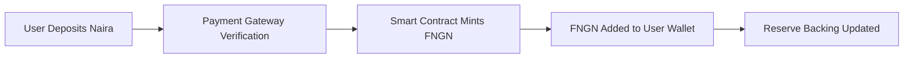
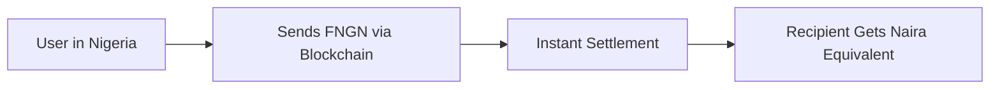
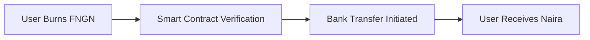
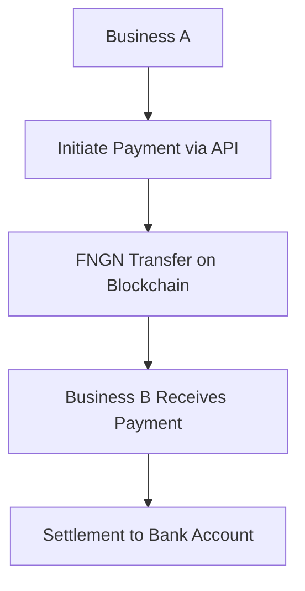

# FSPay Stablecoin & Blockchain Payment Gateway

This document explains how FSPay's stablecoin (FNGN) and blockchain payment gateway work for cross-border payments and B2B settlements. This is safe for public consumption and focuses on functionality without implementation details.

## 🏦 **FNGN Stablecoin Overview**

FNGN is a Nigerian Naira-pegged stablecoin designed for seamless value transfer across borders. It maintains a 1:1 peg with the Nigerian Naira while providing the benefits of blockchain technology.

### **Key Features**
- **1:1 Naira Peg**: 1 FNGN = 1 NGN, always
- **Multi-Chain Support**: Available on Ethereum, BSC, and other networks
- **Instant Settlement**: Near-instant cross-border transfers
- **Low Fees**: Competitive transaction costs
- **Transparency**: Real-time proof-of-reserve verification

### **How It Works**

#### **1. Minting Process**


#### **2. Cross-Border Transfer**


#### **3. Redemption Process**


## 🌐 **Cross-Border Payment Flow**

FNGN enables seamless international money transfers with traditional banking integration.

### **Payment Process**
1. **Sender** deposits Naira via bank transfer or payment gateway
2. **FNGN minted** and credited to sender's wallet
3. **Blockchain transfer** initiated to recipient's wallet
4. **Recipient redeems** FNGN for local currency
5. **Bank settlement** completes the transaction

### **Benefits for Cross-Border Payments**
- **Speed**: Minutes instead of days
- **Cost**: Lower fees than traditional remittance services
- **Transparency**: Real-time transaction tracking
- **Security**: Blockchain-level security with bank settlement
- **Accessibility**: Works with existing banking infrastructure

## 🏢 **B2B Payment Gateway**

The B2B payment gateway enables businesses to send and receive payments using stablecoin technology while maintaining traditional business workflows.

### **Business Account Setup**
```http
POST /api/b2b/register
Content-Type: application/json

{
  "businessName": "Your Company Ltd",
  "businessEmail": "finance@yourcompany.com",
  "businessType": "e-commerce",
  "dailyLimit": 1000000
}
```

**Response:**
```json
{
  "success": true,
  "data": {
    "businessId": "biz_abc123",
    "apiKey": "your_business_api_key",
    "custodialWallet": "0x742d35Cc6635C0532925a3b8D0007d2e5e0f5e6f7"
  }
}
```

### **B2B Payment Process**


### **API Integration Examples**

#### **Process Payment**
```javascript
const response = await fetch('https://api.fspay.ng/api/b2b/payments', {
  method: 'POST',
  headers: {
    'Content-Type': 'application/json',
    'X-API-Key': 'your_business_api_key'
  },
  body: JSON.stringify({
    toBusinessId: 'recipient_business_id',
    amount: 50000,
    currency: 'FNGN',
    reference: 'INV_12345',
    description: 'Payment for services'
  })
});
```

#### **Check Balance**
```javascript
const response = await fetch('https://api.fspay.ng/api/b2b/balance', {
  headers: {
    'X-API-Key': 'your_business_api_key'
  }
});

const data = await response.json();
// Returns available balance, escrow balance, daily limits
```

#### **Get Transaction History**
```javascript
const response = await fetch('https://api.fspay.ng/api/b2b/transactions?limit=50', {
  headers: {
    'X-API-Key': 'your_business_api_key'
  }
});
```

## 🔄 **P2P Trading System**

The P2P trading platform enables peer-to-peer exchange of FNGN and other stablecoins with escrow protection.

### **How P2P Trading Works**
1. **Create Advertisement**: Set buy/sell rates and payment methods
2. **Match Orders**: System matches compatible trades
3. **Escrow Protection**: Funds held in smart contract escrow
4. **Payment Verification**: Buyer confirms payment
5. **Auto-Release**: Funds released to seller after confirmation

### **Trading Features**
- **Multi-Currency**: Trade between NGN, USD, EUR, GBP and stablecoins
- **Payment Methods**: Bank transfer, mobile money, cash payments
- **Escrow Protection**: Smart contract security for all trades
- **Dispute Resolution**: Built-in mediation system
- **Rating System**: User reputation and trust scores

### **Cross-Border P2P Trading**
- **International Sellers**: List competitive exchange rates
- **Local Payment Methods**: Accept payments in local currencies
- **Global Settlement**: Receive payments in preferred currency
- **Risk Management**: Built-in fraud prevention and verification

## 🛡️ **Security & Compliance**

### **Multi-Layer Security**
1. **Blockchain Security**: Cryptographic transaction verification
2. **Smart Contract Audits**: Independent security reviews
3. **KYC/AML Compliance**: Regulatory compliance for all users
4. **Proof of Reserve**: Real-time reserve transparency
5. **Insurance Coverage**: Protection against smart contract risks

### **Cross-Border Compliance**
- **Multi-Jurisdiction Support**: Compliant in 50+ countries
- **Regulatory Reporting**: Automated compliance reporting
- **Transaction Monitoring**: AML and fraud detection
- **Data Protection**: GDPR and local privacy compliance

## 📊 **Proof of Reserve System**

FSPay maintains 100% reserve backing for all FNGN tokens in circulation.

### **Reserve Transparency**
- **Real-Time Verification**: Live reserve balance checking
- **Independent Audits**: Regular third-party audits
- **Public Dashboard**: Reserve status visible to all users
- **Automated Snapshots**: Regular reserve balance recording

### **Reserve Management**
```javascript
// Example reserve verification (public endpoint)
const response = await fetch('https://api.fspay.ng/api/stablecoin/proof-of-reserve');
const data = await response.json();

// Returns:
// - Total FNGN supply across all networks
// - Naira reserve balance
// - Reserve ratio (always 100%+)
// - Last audit timestamp
```

## 🌍 **Cross-Border Use Cases**

### **International Remittances**
- **Workers Abroad**: Send money home instantly
- **Family Support**: Regular remittance payments
- **Business Payments**: International supplier payments
- **Investment Flows**: Cross-border investment transfers

### **B2B International Trade**
- **Import/Export**: Pay international suppliers
- **Service Payments**: Freelancer and contractor payments
- **Marketplace Settlements**: Multi-currency marketplace payments
- **Supply Chain**: Global supply chain payments

### **E-commerce Expansion**
- **Cross-Border Sales**: Accept international payments
- **Global Marketplaces**: Multi-currency marketplace platforms
- **Digital Services**: International service payments
- **Subscription Billing**: Global subscription management

## 🔧 **Integration Benefits**

### **For Businesses**
- **Lower Costs**: Reduced payment processing fees
- **Faster Settlement**: Near-instant cross-border payments
- **Global Reach**: Access to international markets
- **Risk Reduction**: Smart contract protection

### **For Individuals**
- **Lower Remittance Costs**: Cheaper international transfers
- **Faster Delivery**: Minutes instead of days
- **Better Rates**: Competitive exchange rates
- **Security**: Bank-level security with blockchain transparency

## 📈 **Performance Metrics**

### **Transaction Speed**
- **FNGN Transfers**: < 30 seconds
- **Cross-Border**: 2-5 minutes
- **Bank Settlement**: Same business day
- **P2P Trading**: 5-15 minutes (with escrow)

### **Cost Structure**
- **Minting Fee**: 0.5-1.0% (varies by volume)
- **Transfer Fee**: < 0.1% for blockchain transfers
- **Redemption Fee**: 0.5-1.0%
- **Cross-Border Fee**: 1-2% (includes bank charges)

## 🚀 **Getting Started**

### **For Individual Users**
1. **Create Account**: Sign up with email and phone verification
2. **Complete KYC**: Identity verification for compliance
3. **Add Payment Method**: Link bank account or card
4. **Start Transacting**: Send and receive FNGN instantly

### **For Businesses**
1. **Apply Online**: Submit business registration form
2. **API Integration**: Get API credentials after approval
3. **Testing**: Use sandbox environment for development
4. **Go Live**: Switch to production after testing

### **For Developers**
1. **API Access**: Request developer credentials
2. **Documentation**: Review integration guides
3. **Testing**: Use sandbox for development
4. **Support**: Access to developer support team

## 📞 **Support & Resources**

### **Developer Resources**
- **API Documentation**: Complete endpoint reference
- **Code Examples**: Multiple programming languages
- **Testing Tools**: Sandbox environment and testing utilities
- **Community**: Developer forums and support

### **Business Support**
- **Integration Assistance**: Dedicated support for enterprise customers
- **Custom Solutions**: Tailored integration for specific needs
- **SLA Guarantees**: 99.9% uptime commitments
- **Direct Access**: Priority support channels

## 🔄 **Migration from Traditional Systems**

### **For Payment Processors**
- **Easy Integration**: RESTful APIs with familiar patterns
- **No Blockchain Knowledge Required**: Abstracted complexity
- **Gradual Migration**: Start with pilot, scale gradually
- **Support Available**: Full integration support provided

### **For Businesses**
- **Familiar UX**: Traditional payment flows with enhanced features
- **Bank Integration**: Seamless connection to existing banking
- **Compliance Ready**: Built-in regulatory compliance
- **Cost Savings**: Lower fees than traditional cross-border payments

## 📋 **Compliance & Regulation**

### **Regulatory Compliance**
- **CBN Alignment**: Compliant with Nigerian banking regulations
- **International Standards**: Follows FATF and international AML guidelines
- **KYC Requirements**: Multi-tier verification system
- **Reporting**: Automated regulatory reporting

### **Transparency Features**
- **Real-Time Reserves**: Live reserve balance verification
- **Audit Trails**: Complete transaction history
- **Public Dashboards**: Reserve and network status visibility
- **Independent Audits**: Regular third-party verification

---

**FSPay Stablecoin** - Enabling seamless cross-border payments with the security of traditional banking and the efficiency of blockchain technology.

*This documentation is safe for public consumption and does not contain implementation details.*
